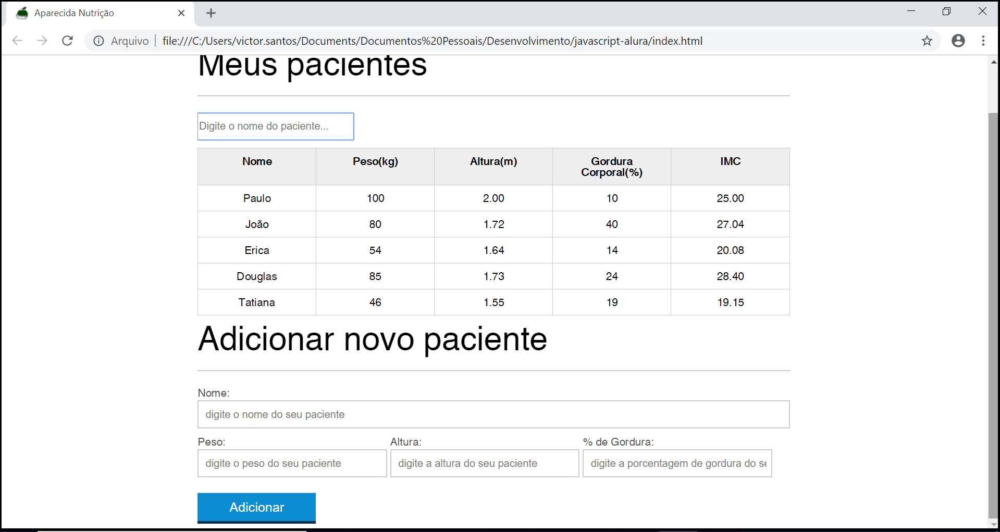
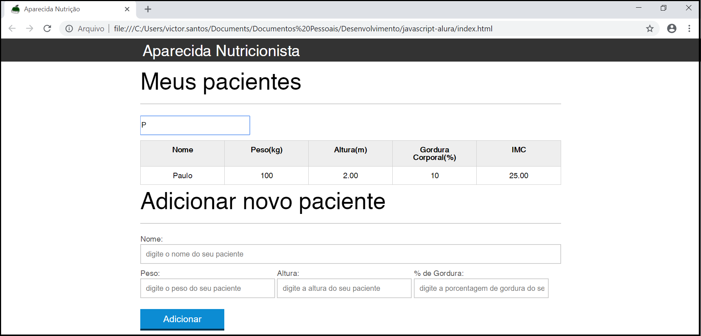
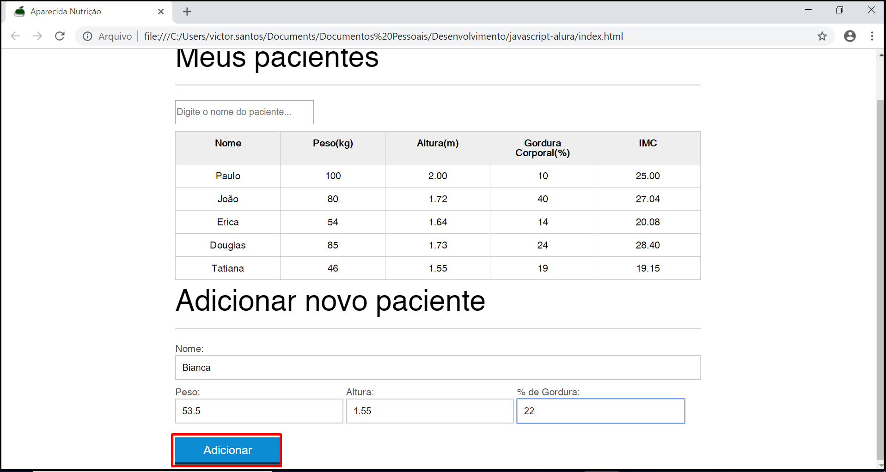
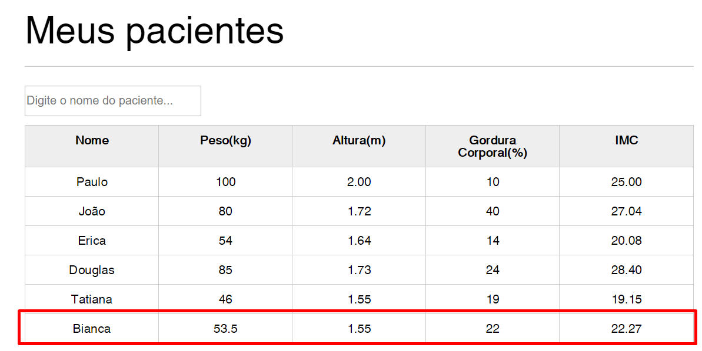
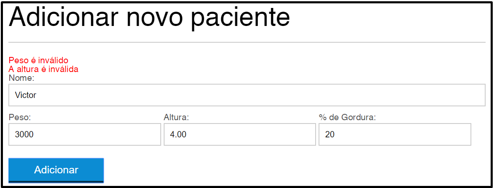

## Controle de Pacientes - Curso de JavaScript básico Alura

Página criada seguindo os passos do curso de JavaScript básico da Alura.

A aplicação possui as seguintes funcionalidades:
- Filtro de pacientes utilizando RegEx

- Adicionar novo paciente

- Cálculo automático do IMC do paciente

- Validações dos dados inseridos: altura e peso

Página elaborada por: Douglas Quintanilha (instrutor na Alura)

//===============================================================================//

## Patient Control - Basic JavaScript course at Alura

The page was created following the steps of the basic JavaScript course at Alura.

The application has the following features:
- Patient filter using RegEx
- Add new patient
- Automatic calculation of patient's BMI (Body Mass Index)
- Inputed data validation: weight and height

Page elaborated by: Douglas Quintanilha (instructor at Alura)